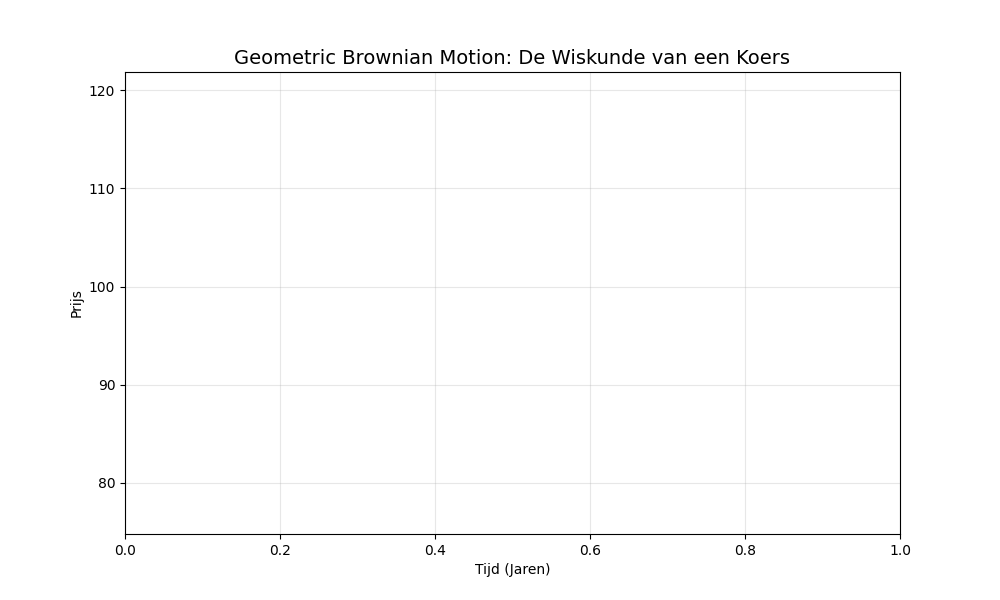
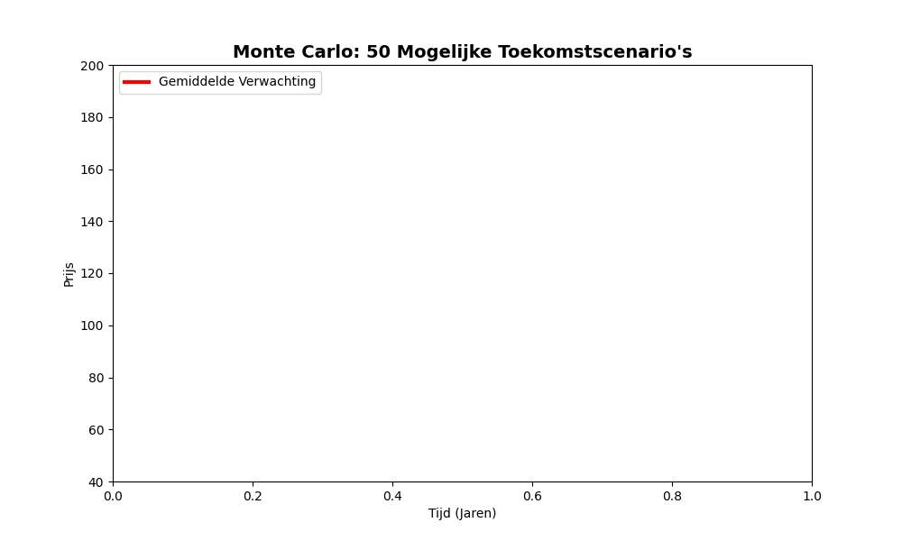
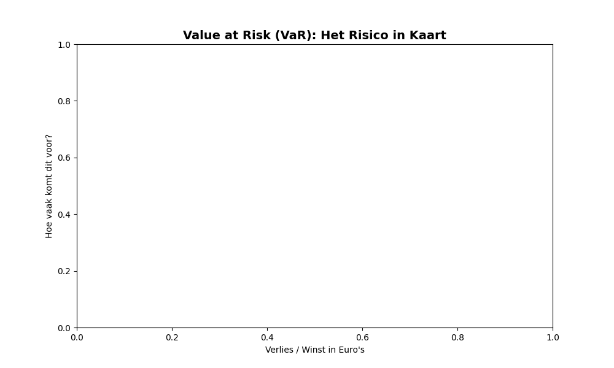
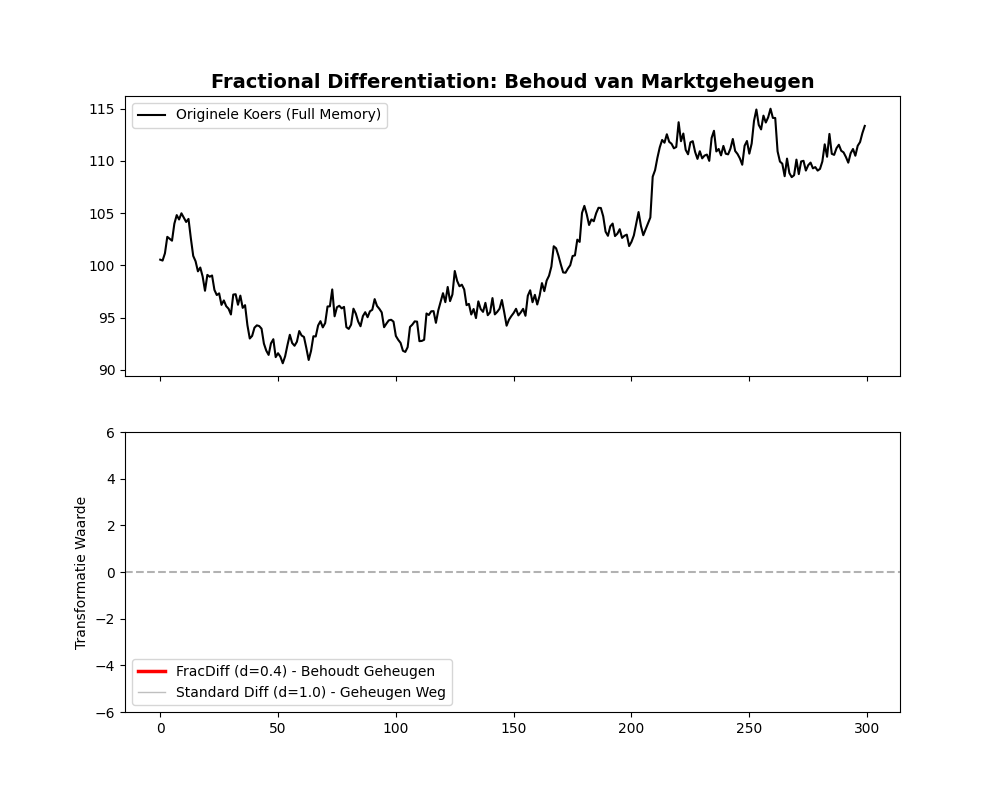

# Financiële Simulaties & Risico Modellering 📊

Dit project visualiseert hoe wiskundige modellen worden gebruikt om aandelenkoersen te simuleren en financiële risico's te berekenen.

## 1. Geometric Brownian Motion (GBM)
De 'motor' achter de meeste financiële modellen. Het combineert een gemiddelde stijging (drift) met willekeurige schommelingen (volatiliteit).

## 2. Monte Carlo Simulatie
Door de GBM-berekening duizenden keren te herhalen, ontstaat een 'waaier' van mogelijke toekomstscenario's. Dit helpt bij het begrijpen van onzekerheid.

## 3. Value at Risk (VaR)
Een cruciaal instrument voor risicobeheer. Het berekent het maximale verlies dat men met een bepaalde zekerheid (bijv. 95%) kan verwachten op een dag.
- **Blauwe zone:** Normale schommelingen.
- **Rode zone:** De extreme verliezen (het risico).

## 4. Fractional Differentiation (FracDiff)
De 'Golden Mean' van data-transformatie. Waar standaard differentiatie alle geheugen wist, behoudt FracDiff de waardevolle marktstructuur.
- **Rode lijn (d=0.4):** Behoudt het lange-termijn geheugen (Hurst).
- **Grijze lijn (d=1.0):** Standaard methode waarbij alle informatie verloren gaat.

---
*Gemaakt voor educatieve doeleinden door Spectrale schets.*
